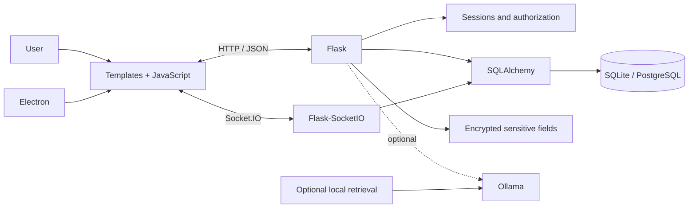

# HelpDesk & IT Operations

[Português](README.md)

I built HelpDesk to bring together IT work that was scattered across messages, email and spreadsheets. The internal version is used by **11 people** for tickets, assets, access management and team communication.

## Overview

| Area | Current implementation |
|---|---|
| **Tickets and operations** | Priority, category, history, tracking and real-time communication. |
| **Assets and access** | Users, computers, software, certificates, maintenance, accounts and shared resources. |
| **Backend** | Flask, SQLAlchemy, sessions, APIs and Flask-SocketIO. |
| **Desktop** | Electron client with tray, notifications and Socket.IO events. |
| **Security** | Password hashing, Fernet-encrypted fields, masking, restricted origins and sandboxed Electron. |
| **Optional AI** | Ollama and local text retrieval; core modules continue to work without AI. |
| **Quality** | Pytest, Ruff, Node Test Runner, CI, CodeQL and public-release validation. |

The internal version remains active. I plan to move its capabilities gradually into the **Portal** IT module while preserving history, traceability and access rules.

> This repository is a sanitized public edition. Operational data, credentials, names, internal addresses and infrastructure settings were removed or replaced.

## What I built

- ticket creation, priority, category, history and tracking;
- user, computer, software, certificate and maintenance inventory;
- account, access, shortcut and controlled-share management;
- real-time chat and desktop notifications;
- audit trail;
- optional local-AI assistance.

## Interface

| Module portal | Authentication |
|---|---|
|  |  |

| Ticket creation | Internal chat |
|---|---|
|  |  |

## Current architecture

The application is a **Flask monolith** with business domains, APIs, templates and Socket.IO events in the same process. This keeps the internal operation simple. The large main file still concentrates responsibilities and remains documented as technical debt.



## Engineering decisions

- SQLite by default for local use and evaluation, with PostgreSQL available by configuration;
- Werkzeug password hashing;
- encrypted operational fields and masked common API responses;
- restricted Socket.IO origins;
- Electron with `contextIsolation`, `sandbox` and `nodeIntegration: false`;
- validated manual updates instead of executing arbitrary binaries;
- optional Ollama, Redis and local retrieval without blocking core modules.

## Stack

| Layer | Technologies |
|---|---|
| Backend | Python 3.12, Flask, Flask-SQLAlchemy, SQLAlchemy |
| Real time | Flask-SocketIO, Socket.IO |
| Frontend | Jinja2, HTML, CSS, JavaScript |
| Database | SQLite, optional PostgreSQL |
| Desktop | Electron, Node.js |
| Security | Werkzeug hashing, Fernet, cookies and restricted origins |
| Optional AI | Ollama, TF-IDF, scikit-learn, Redis |
| Quality | Pytest, Ruff, Node Test Runner, CodeQL, GitHub Actions |

## Run locally

```bash
git clone https://github.com/Mayconxzdev/HelpDesk.git
cd HelpDesk
python -m venv .venv
```

Windows PowerShell:

```powershell
.venv\Scripts\Activate.ps1
Copy-Item .env.example .env
pip install -r requirements-dev.txt
python app.py
```

Electron client:

```bash
cd hd_electron
npm install
```

## Validation

```bash
pip install -r requirements-dev.txt
python scripts/validate_public_release.py
python scripts/check_markdown_links.py
python scripts/check_npm_lock.py
python -m pip check
ruff check .
python -m compileall -q app.py ia.py security_utils.py tests scripts
python -m pytest -q

cd hd_electron
npm ci --ignore-scripts
npm run check
```

## Current limits

- no hosted public demo;
- `app.py` still needs to be separated into blueprints and services;
- no complete database-migration framework;
- process-local rate limiting;
- chat files remain database payloads rather than object storage;
- simplified permission matrix;
- Ollama, Redis and PostgreSQL depend on the environment;
- the system provides traceability but does not certify ISO 9001 compliance.

## Author

**Maycon da Silva Ferreira** — product, architecture, backend, interface, desktop client, security, deployment, training and support.
