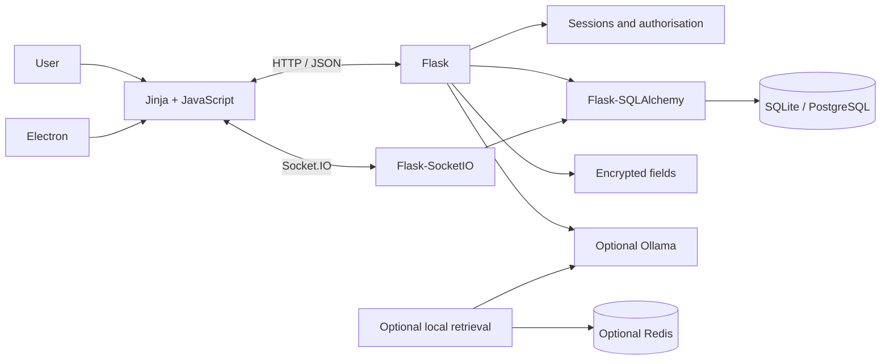

<div align="center">

# HelpDesk & IT Operations

### Internal support, asset, access, communication and local-AI workspace

[](https://github.com/Mayconxzdev/HelpDesk/actions/workflows/ci.yml)
[](https://github.com/Mayconxzdev/HelpDesk/actions/workflows/codeql.yml)


[Product case](docs/PORTFOLIO_CASE_STUDY.md) ·
[Architecture](docs/ARCHITECTURE.md) ·
[Project status](docs/PROJECT_STATUS.md) ·
[CI](docs/CI.md) ·
[Português](README.md)

</div>

---

## Overview

**HelpDesk & IT Operations** combines ticket management, IT assets, operational access records, network shortcuts, real-time chat and optional local AI support in one internal workspace.

The public repository is presented as a **modernisation case**. It keeps the working product, removes operational data, fixes critical security issues and documents its technical debt instead of presenting a prototype as a production-certified platform.

### What the project demonstrates

- Flask APIs, sessions and SQLAlchemy models;
- real-time communication with Flask-SocketIO;
- server-rendered HTML, CSS and vanilla JavaScript;
- an Electron desktop shell with tray and native notifications;
- SQLite for local review and configurable PostgreSQL support;
- encrypted operational secrets and masked API payloads;
- optional Ollama, Redis and local contextual retrieval;
- tests, critical lint rules, public-release checks, CI and CodeQL.

> **Scope:** portfolio and technical reference implementation. It is not an ISO 9001 certification, a public SaaS product or a production-approved credential vault. See [`docs/PROJECT_STATUS.md`](docs/PROJECT_STATUS.md).

## Five-minute review path

1. Inspect the [real interface](#real-interface).
2. Read the [product case](docs/PORTFOLIO_CASE_STUDY.md).
3. Review the [architecture decisions](docs/ARCHITECTURE.md).
4. Check the [security changes](docs/SECURITY.md).
5. Run the repository validation, Python tests and Electron checks.

## Real interface


<table>
<tr><td width="50%">

### Authentication


</td><td width="50%">

### Ticket intake


</td></tr>
<tr><td width="50%">

### Managed shortcuts


</td><td width="50%">

### Internal chat


</td></tr>
</table>

## Product journeys

- **Support:** authenticate → create ticket → assign priority and owner → document actions → close with history.
- **Asset lifecycle:** register employee → associate hardware and accounts → record maintenance and reviews → audit changes.
- **Communication:** join authorised rooms → exchange messages and media → receive Socket.IO events and desktop notifications.
- **Local AI:** assemble authorised inventory context → call Ollama only when enabled → use an optional local retrieval helper and Redis cache.

## Architecture

The current system is a Flask monolith. This keeps deployment simple for an internal tool, although `app.py` still concentrates responsibilities and is explicitly documented as technical debt.



## Security improvements in this public version

- production secret validation and safer session cookies;
- same-origin validation for state-changing browser requests;
- restricted Socket.IO origins;
- protected sensitive routes and safe post-login redirects;
- Werkzeug password hashing;
- Fernet encryption for credential-like operational fields;
- masked secrets in normal API responses;
- Electron sandbox, isolated context and no Node.js in the renderer;
- removal of arbitrary executable download-and-run behaviour;
- automated checks for private data and dangerous patterns.

## Technology

| Layer | Technology |
|---|---|
| Backend | Python 3.12, Flask, SQLAlchemy |
| Real time | Flask-SocketIO, Socket.IO |
| Frontend | Jinja2, HTML, CSS, JavaScript |
| Data | SQLite, optional PostgreSQL |
| Desktop | Electron, Node.js |
| Security | Werkzeug hashes, Fernet, security headers |
| Optional AI | Ollama, TF-IDF, scikit-learn, Redis |
| Quality | Pytest, Ruff, Node Test Runner, CodeQL, GitHub Actions |

## Local setup

```bash
git clone https://github.com/Mayconxzdev/HelpDesk.git
cd HelpDesk
python -m venv .venv
source .venv/bin/activate  # Windows: .venv\Scripts\Activate.ps1
cp .env.example .env       # Windows: Copy-Item .env.example .env
pip install -r requirements-dev.txt
python app.py
```

Open `http://127.0.0.1:5000`.

Local-only demo identities:

```text
demo_admin / change-me-local
demo_user  / change-me-local
```

Electron:

```bash
cd hd_electron
npm ci
HELPDESK_SERVER_URL=http://127.0.0.1:5000 npm start
```

## Validation

```bash
python scripts/validate_public_release.py
python scripts/check_markdown_links.py
ruff check .
python -m compileall -q app.py ia.py security_utils.py tests scripts
python -m pytest -q
cd hd_electron && npm ci --ignore-scripts && npm run check
```

## Known limitations

- no public hosted demo;
- the main Flask module still needs Blueprint/service extraction;
- no complete database migration system;
- in-memory rate limiting is process-local;
- chat attachments are database payloads rather than object-storage records;
- simplified role model;
- environment-dependent PostgreSQL, Ollama and Redis integrations;
- audit-friendly controls do not constitute ISO 9001 certification.

## Author

**Maycon da Silva Ferreira** — [@Mayconxzdev](https://github.com/Mayconxzdev)

## License

Released under the [MIT License](LICENSE).
