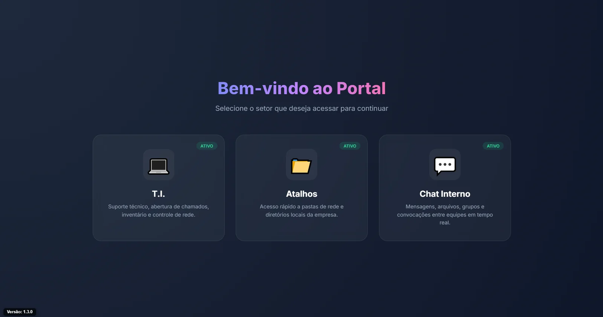
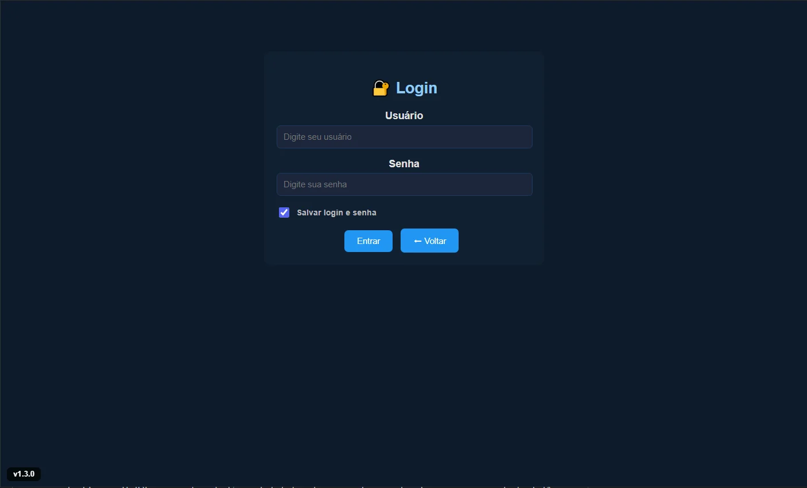
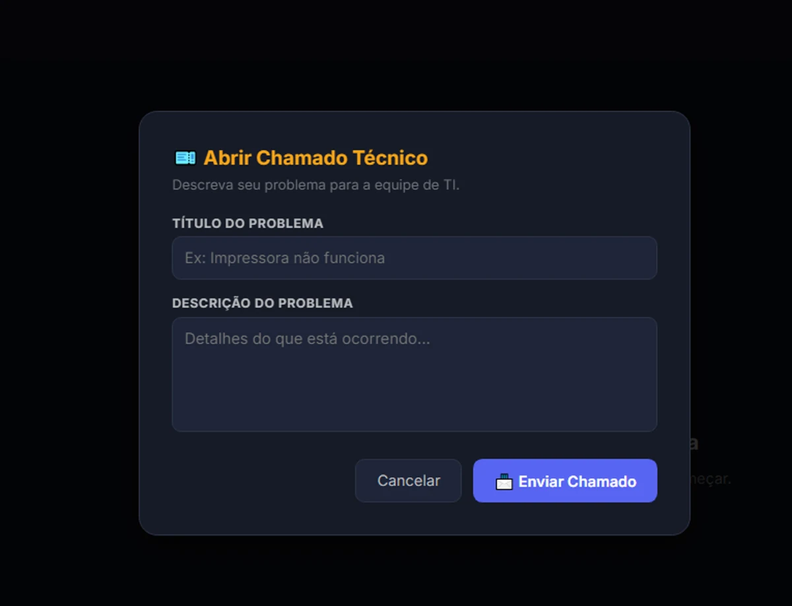
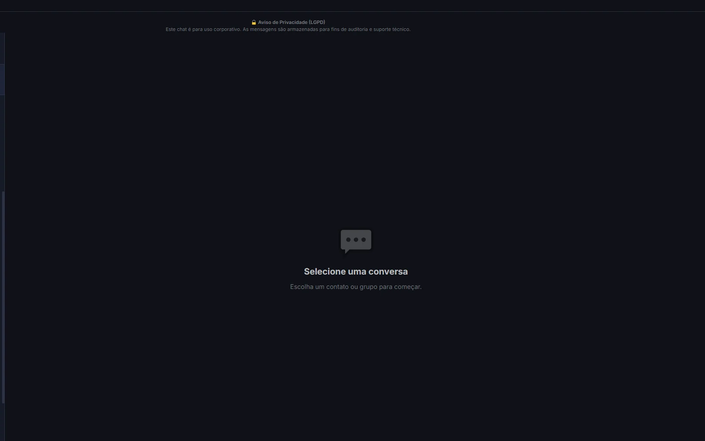
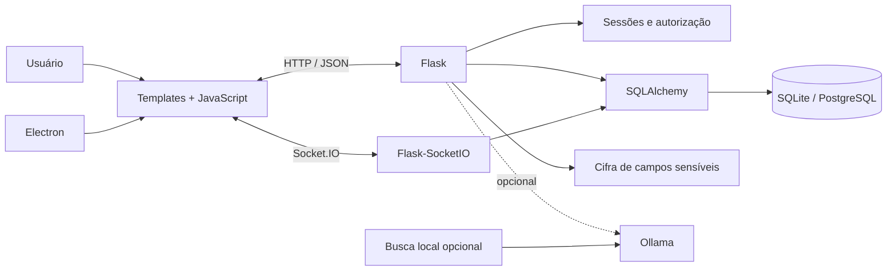

<div align="center">

# HelpDesk & IT Operations

### Central interna para chamados, ativos, acessos, comunicação e assistência local de IA

[](https://github.com/Mayconxzdev/HelpDesk/actions/workflows/ci.yml)
[](https://github.com/Mayconxzdev/HelpDesk/actions/workflows/codeql.yml)


[Case de produto](docs/PORTFOLIO_CASE_STUDY.md) · [Arquitetura](docs/ARCHITECTURE.md) · [Estado](docs/PROJECT_STATUS.md) · [Segurança](docs/SECURITY.md) · [English](README.en.md)

</div>

## Leitura rápida para recrutadores

| Dimensão | Evidência |
|---|---|
| **Uso real** | A versão interna é utilizada por 11 pessoas para abertura e acompanhamento de chamados, consulta de ativos, gestão de acessos e comunicação. |
| **Backend** | Flask, SQLAlchemy, sessões, APIs e Flask-SocketIO. |
| **Desktop e tempo real** | Cliente Electron com tray/notificações e comunicação Socket.IO. |
| **Segurança** | Hash de senhas, Fernet para campos sensíveis, mascaramento, origem restrita, Electron em sandbox e validação pública automatizada. |
| **IA opcional** | Ollama e recuperação textual local; o funcionamento principal não depende de IA. |
| **Qualidade** | Pytest, Ruff, Node Test Runner, CI, CodeQL e auditoria da distribuição pública. |

## Problema resolvido

Equipes internas de TI costumam trabalhar com informações fragmentadas entre mensagens, e-mails e planilhas. O HelpDesk reúne:

- abertura, prioridade, categoria, histórico e acompanhamento de chamados;
- inventário de usuários, computadores, programas, certificados e manutenção;
- gestão de contas, acessos, atalhos e compartilhamentos;
- chat em tempo real e notificações no cliente desktop;
- trilha de auditoria e apoio local de IA quando habilitado.

A versão interna permanece ativa. Suas capacidades serão incorporadas gradualmente ao módulo de TI do **Portal**, preservando histórico, rastreabilidade e regras de acesso.

> O repositório é uma edição pública sanitizada. Dados operacionais, credenciais, nomes, endereços internos e configurações de infraestrutura foram removidos ou substituídos por exemplos.

## Interface

| Portal de módulos | Autenticação |
|---|---|
|  |  |

| Abertura de chamado | Chat interno |
|---|---|
|  |  |

## Arquitetura atual

O projeto é um **monólito Flask** com domínios, APIs, templates e eventos Socket.IO no mesmo processo. A escolha reduz a complexidade operacional para um sistema interno, mas o arquivo principal ainda concentra responsabilidades e está documentado como dívida técnica.



## Decisões relevantes

- SQLite por padrão para avaliação local e PostgreSQL por configuração;
- senhas de login com hash Werkzeug;
- campos operacionais sensíveis cifrados e mascarados nas respostas comuns;
- Socket.IO com origem restrita;
- Electron com `contextIsolation`, `sandbox` e `nodeIntegration: false`;
- atualização manual validada em vez de executar binários arbitrários;
- Ollama, Redis e recuperação local são opcionais e não bloqueiam os módulos principais.

## Stack

| Camada | Tecnologias |
|---|---|
| Backend | Python 3.12, Flask, Flask-SQLAlchemy, SQLAlchemy |
| Tempo real | Flask-SocketIO, Socket.IO |
| Frontend | Jinja2, HTML, CSS, JavaScript |
| Banco | SQLite, PostgreSQL opcional |
| Desktop | Electron, Node.js |
| Segurança | Werkzeug hashing, Fernet, cookies e origem restrita |
| IA opcional | Ollama, TF-IDF, scikit-learn, Redis |
| Qualidade | Pytest, Ruff, Node Test Runner, CodeQL, GitHub Actions |

## Executar localmente

```bash
git clone https://github.com/Mayconxzdev/HelpDesk.git
cd HelpDesk
python -m venv .venv
```

Windows PowerShell:

```powershell
.venv\Scripts\Activate.ps1
Copy-Item .env.example .env
pip install -r requirements-dev.txt
python app.py
```

Cliente Electron:

```bash
cd hd_electron
npm install
```

## Validar

```bash
pip install -r requirements-dev.txt
python scripts/validate_public_release.py
python scripts/check_markdown_links.py
python scripts/check_npm_lock.py
python -m pip check
ruff check .
python -m compileall -q app.py ia.py security_utils.py tests scripts
python -m pytest -q

cd hd_electron
npm ci --ignore-scripts
npm run check
```

## Limitações conhecidas

- não há demonstração pública hospedada;
- `app.py` ainda deve ser dividido por blueprints e serviços;
- não existe sistema completo de migrações de banco;
- rate limit é local ao processo;
- arquivos do chat ainda ficam no banco, não em object storage;
- matriz de permissões é simplificada;
- Ollama, Redis e PostgreSQL dependem do ambiente;
- o sistema oferece rastreabilidade, mas não certifica conformidade ISO 9001.

## Autor

**Maycon da Silva Ferreira** — produto, arquitetura, backend, interface, cliente desktop, segurança, implantação, treinamento e sustentação.

## Licença

Distribuído sob a [licença MIT](LICENSE).
