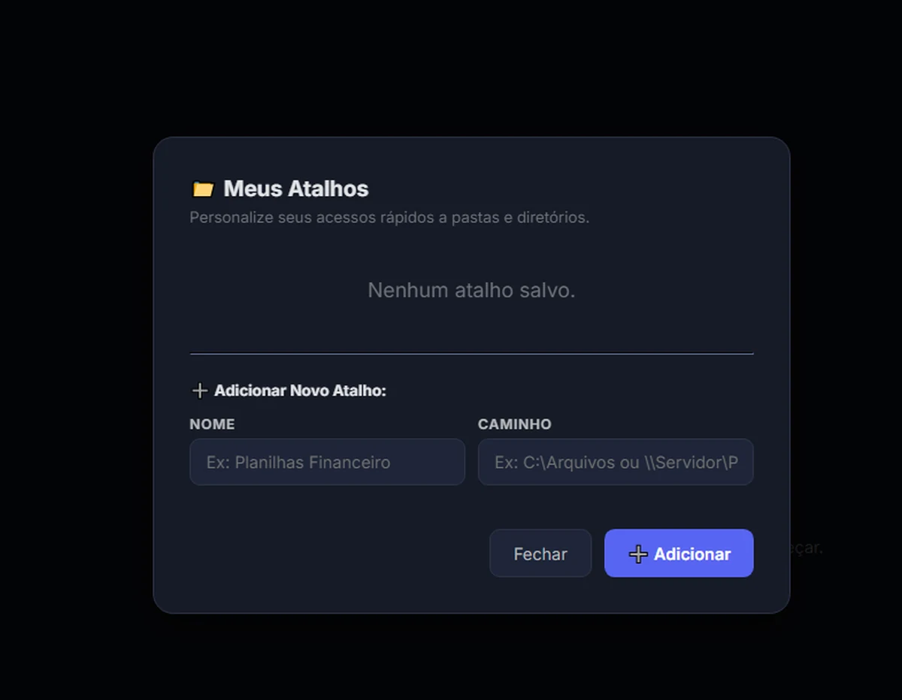
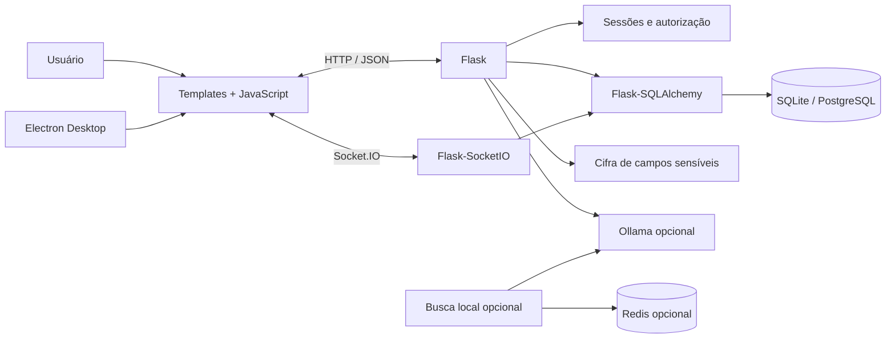

<div align="center">

# HelpDesk & IT Operations

### Central interna para chamados, ativos, acessos, comunicação e assistência local de IA

[](https://github.com/Mayconxzdev/HelpDesk/actions/workflows/ci.yml)
[](https://github.com/Mayconxzdev/HelpDesk/actions/workflows/codeql.yml)


[Case de produto](docs/PORTFOLIO_CASE_STUDY.md) ·
[Arquitetura](docs/ARCHITECTURE.md) ·
[Estado do projeto](docs/PROJECT_STATUS.md) ·
[CI](docs/CI.md) ·
[English](README.en.md)

</div>

---

## Visão geral

O **HelpDesk & IT Operations** é um sistema interno que reúne abertura e acompanhamento de chamados, inventário de ativos, gestão de acessos, atalhos de rede, chat em tempo real e apoio local de IA.

O valor do projeto está na integração de jornadas que normalmente ficam espalhadas entre e-mail, planilhas, mensagens e ferramentas isoladas. A versão pública foi preparada como um **case de modernização técnica**: preserva o produto funcional, remove dados operacionais, corrige riscos críticos e documenta com honestidade o que está maduro e o que ainda precisa evoluir.

### O que este projeto demonstra

- backend Flask com APIs, sessões e SQLAlchemy;
- comunicação em tempo real com Flask-SocketIO;
- interface web em HTML, CSS e JavaScript sem framework;
- cliente desktop Electron com tray e notificações;
- SQLite para desenvolvimento e PostgreSQL por configuração;
- campos sensíveis cifrados e mascarados nas respostas comuns;
- integração opcional com Ollama, Redis e busca local por contexto;
- O funcionamento principal do sistema não depende de IA. Ollama, Redis e recuperação textual avançada são integrações opcionais: quando não estão configuradas, chamados, ativos, acessos, chat e auditoria continuam disponíveis.
- testes, lint crítico, validação de distribuição pública, CI e CodeQL.

> **Escopo:** projeto de portfólio e referência técnica. Não representa certificação ISO 9001, produto SaaS público ou ambiente homologado para armazenar credenciais reais. As limitações estão descritas em [`docs/PROJECT_STATUS.md`](docs/PROJECT_STATUS.md).

### Estado operacional

A versão interna está instalada nos computadores da empresa e é utilizada por **11 pessoas** para abertura e acompanhamento de chamados, consulta de ativos, gestão de acessos e comunicação interna.

Este repositório contém uma edição pública sanitizada. Dados operacionais, credenciais, nomes, endereços internos, registros empresariais e configurações de infraestrutura foram removidos ou substituídos por exemplos fictícios.

O HelpDesk continuará ativo durante a transição. Quando o **Portal Vesper** concluir a consolidação dos processos, suas funcionalidades serão incorporadas ao módulo de TI do Portal, preservando histórico, rastreabilidade e regras de acesso.

## Caminho de avaliação em 5 minutos

1. Veja a [interface real](#interface-real).
2. Leia o [problema e as jornadas](docs/PORTFOLIO_CASE_STUDY.md).
3. Confira as [decisões de arquitetura](docs/ARCHITECTURE.md).
4. Analise as [correções de segurança](docs/SECURITY.md).
5. Execute `python scripts/validate_public_release.py`, `python -m pytest -q` e `npm run check`.

---

## Interface real

As capturas abaixo vieram da aplicação em execução. Dados pessoais e referências corporativas foram removidos da distribuição pública.

### Portal de módulos


<table>
<tr>
<td width="50%">

### Autenticação


</td>
<td width="50%">

### Abertura de chamado


</td>
</tr>
<tr>
<td width="50%">

### Atalhos controlados



</td>
<td width="50%">

### Chat interno


</td>
</tr>
</table>

---

## Problema de produto

Equipes internas de TI costumam trabalhar com informações fragmentadas:

- chamados chegam por mensagem ou conversa informal;
- inventário e acessos ficam em planilhas diferentes;
- contexto de resolução se perde depois do atendimento;
- atalhos e compartilhamentos dependem de conhecimento individual;
- comunicação urgente não possui rastreabilidade suficiente.

O sistema organiza esse cenário em uma experiência única, com autenticação, histórico, registro de alterações e comunicação em tempo real.

## Jornadas principais

### Solicitação e atendimento

Usuário autentica → abre o chamado → prioridade e categoria são registradas → equipe acompanha histórico e prazo → solução e tempo gasto ficam documentados.

### Inventário e ciclo de vida

TI cadastra colaborador → associa equipamento, contas, programas e certificados → registra manutenção e revisões → alterações relevantes entram na trilha de auditoria.

### Comunicação interna

Usuário entra no chat → acessa conversas autorizadas → envia texto ou mídia → mensagens e eventos chegam por WebSocket → notificações podem ser encaminhadas ao cliente Electron.

### Apoio local de IA

O sistema reúne contexto autorizado → envia ao Ollama somente quando a integração está habilitada → a base demonstrativa pode ser consultada localmente → Redis é opcional para cache.

---

## Arquitetura

O projeto atual é um **monólito Flask** com módulos de negócio, APIs, templates e eventos Socket.IO no mesmo processo. Essa escolha reduz a complexidade operacional para um sistema interno, mas o arquivo principal ainda concentra responsabilidades e está documentado como dívida técnica.



### Decisões relevantes

| Decisão | Motivo |
|---|---|
| SQLite por padrão | Permite avaliação local sem infraestrutura externa. |
| PostgreSQL por variável de ambiente | Mantém um caminho para implantação interna mais robusta. |
| Senhas de login com hash Werkzeug | Evita armazenamento reversível das credenciais de autenticação. |
| Campos operacionais cifrados | Evita texto puro para senhas, chaves e tokens cadastrados no módulo de TI. |
| Respostas comuns mascaradas | APIs não devolvem o conteúdo dos segredos por padrão. |
| Socket.IO com origem restrita | Remove o CORS global aberto existente na versão original. |
| Electron em sandbox | Desabilita Node.js no renderer e reduz a superfície de IPC. |
| Atualização manual validada | Remove o download e execução automática de executáveis arbitrários. |

Mais detalhes em [`docs/ARCHITECTURE.md`](docs/ARCHITECTURE.md) e [`docs/SECURITY.md`](docs/SECURITY.md).

---

## Funcionalidades

| Área | Capacidades públicas demonstradas |
|---|---|
| HelpDesk | tickets, prioridade, categoria, histórico, comentários e métricas |
| IT Control | usuários, computadores, manutenção, programas, certificados e auditoria |
| Acessos | contas, e-mails, atalhos e compartilhamentos NAS |
| Chat | conversas, grupos, mídia, leitura, mensagens temporárias e eventos em tempo real |
| Desktop | tray, notificações, single instance e abertura controlada de caminhos |
| IA local | contexto do inventário via Ollama e helper RAG opcional |

## Segurança aplicada na versão pública

- segredo Flask obrigatório em produção;
- cookies `HttpOnly`, `SameSite` e opção `Secure`;
- validação básica de origem em operações de escrita;
- restrição de origens no Socket.IO;
- proteção contra redirecionamento externo após login;
- autenticação exigida nas APIs e telas sensíveis;
- hash de senhas com Werkzeug;
- cifra Fernet para campos operacionais sensíveis;
- mascaramento de segredos nas APIs comuns;
- remoção de chaves públicas de GIF e endereços privados codificados;
- Electron com `contextIsolation`, `sandbox` e `nodeIntegration: false`;
- verificação automática contra arquivos e padrões indevidos no repositório.

Consulte [`SECURITY.md`](SECURITY.md) antes de qualquer implantação real.

---

## Stack

| Camada | Tecnologias |
|---|---|
| Backend | Python 3.12, Flask, Flask-SQLAlchemy, SQLAlchemy |
| Tempo real | Flask-SocketIO, Socket.IO |
| Frontend | Jinja2, HTML, CSS, JavaScript |
| Banco | SQLite, PostgreSQL opcional |
| Desktop | Electron, Node.js |
| Segurança | Werkzeug password hashing, Fernet, headers e origem restrita |
| IA opcional | Ollama, TF-IDF, scikit-learn, Redis |
| Qualidade | Pytest, Ruff, Node Test Runner, CodeQL, GitHub Actions |

## Estrutura

```text
.
├── app.py                         # aplicação Flask e domínios atuais
├── security_utils.py              # cifra e leitura controlada de segredos
├── ia.py                          # helper RAG local opcional
├── templates/                     # interfaces Jinja2
├── static/                        # CSS e JavaScript da aplicação
├── hd_electron/                   # shell desktop seguro
├── tests/                         # testes de contrato e segurança
├── scripts/                       # auditoria da distribuição pública
├── docs/                          # arquitetura, case e estado do projeto
└── .github/workflows/             # CI e CodeQL
```

---

## Execução local

### Requisitos

- Python 3.12;
- Node.js 22 para o cliente Electron;
- Ollama e Redis apenas para funcionalidades opcionais.

### Backend

```bash
git clone https://github.com/Mayconxzdev/HelpDesk.git
cd HelpDesk
python -m venv .venv
```

Windows PowerShell:

```powershell
.venv\Scripts\Activate.ps1
Copy-Item .env.example .env
pip install -r requirements-dev.txt
python app.py
```

Linux/macOS:

```bash
source .venv/bin/activate
cp .env.example .env
pip install -r requirements-dev.txt
python app.py
```

Acesse `http://127.0.0.1:5000`.

Credenciais locais do `.env.example`:

```text
demo_admin / change-me-local
demo_user  / change-me-local
```

Elas existem somente para desenvolvimento e devem ser alteradas ou desabilitadas em qualquer ambiente compartilhado.

### Electron

```bash
cd hd_electron
npm install
```

Configure o servidor antes de iniciar:

```powershell
$env:HELPDESK_SERVER_URL="http://127.0.0.1:5000"
npm start
```

## Validação

```bash
pip install -r requirements-dev.txt
python scripts/validate_public_release.py
python scripts/check_markdown_links.py
python scripts/check_npm_lock.py
python -m pip check
ruff check .
python -m compileall -q app.py ia.py security_utils.py tests scripts
python -m pytest -q

cd hd_electron
npm ci --ignore-scripts
npm run check
```

O GitHub Actions executa os mesmos contratos principais. Consulte [`docs/CI.md`](docs/CI.md). O badge verde deve ser confirmado no commit publicado antes de apresentar o repositório em processos seletivos.

## Limitações conhecidas

- não há demonstração pública hospedada;
- `app.py` ainda é um monólito grande e deve ser dividido por blueprints e serviços;
- não existe sistema completo de migrações de banco;
- o rate limit atual é local ao processo;
- arquivos do chat ainda são mantidos como payload no banco, não em object storage;
- a matriz de permissões é simplificada;
- integração com Ollama, Redis e PostgreSQL depende do ambiente;
- o projeto oferece rastreabilidade, mas não certifica conformidade ISO 9001.

A priorização completa está em [`docs/PROJECT_STATUS.md`](docs/PROJECT_STATUS.md).

## Autor

**Maycon da Silva Ferreira**

- GitHub: [@Mayconxzdev](https://github.com/Mayconxzdev)

## Licença

Distribuído sob a [licença MIT](LICENSE). Marcas e integrações de terceiros seguem seus próprios termos.
